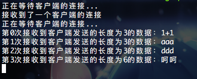
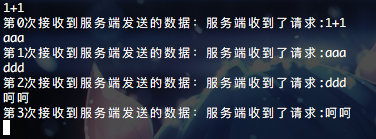
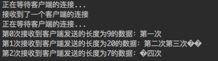

title: 使用Golang自定义基于Tcp的应用层协议 1:Hello World
date: 2018年10月09日
tags:
 - Golang
 - 网络协议
 - Tcp
categories:
 - 技术沉淀
---
&emsp;&emsp;最近工作中遇到这样一个场景：服务端控制机器人执行动作，机器人和服务端都是C++写的，应用层协议是自定义的。然后要写一个模拟器，模拟机器人的逻辑，执行服务端下发的控制指令。以便服务端升级算法时，不需要机器人实际运行，只需要在模拟器运行一遍就知道算法的优劣。
&emsp;&emsp;由于公司的技术栈收敛成了Golang，所以模拟器也需要用Golang写。这样就出现了一个问题，需要用Golang实现服务端与机器人的通信协议，期间踩了不少坑，在这里复盘一下，从零搭建一个自定义应用层协议的服务器。
<!-- more -->
----------------
代码地址：https://github.com/xyb-blog-example/tcp-server/tree/master/v1
测
# 服务端
&emsp;&emsp;作为服务端对外提供服务，首先要监听端口，然后接受客户端的连接，建立连接后对客户端的输入进行处理，当然最好情况是能够同时处理多个客户端的输入。所以每当与一个客户端建立一个连接后，就启动一个goroutine，每个goroutine维护一个单独连接。代码如下：

```go
func CreateServer() {
    //1 创建listener，内部创建了socket，开始监听端口
    listener, err := net.Listen("tcp", "localhost:8000")
    if err != nil {
        fmt.Println("监听端口失败,error:", err.Error())
        os.Exit(0) //终止程序
    }

    //2 持续等待来自客户端的连接并对连接进行处理
    for {
        //2.1 listener.Accept是一个阻塞方法，只有客户端连接时才会有返回
        fmt.Println("正在等待客户端的连接...")
        conn, err := listener.Accept()
        if err != nil {
            fmt.Println("接受连接失败,error:", err.Error())
            continue
        }
        fmt.Println("接收到了一个客户端的连接")

        //2.2 开goroutine对连接上来的客户端进行处理
        go handleClient(conn)
    }
}
```
&emsp;&emsp;handleClient的参数conn是一个net.Conn类型变量，goroutine可以从conn中读取客户端写入网络的字节流，也可以对其写入字节流传输给客户端。这里的逻辑是每次从网络流中读取数据，最多读20个字节。读取成功后，将每次读取到的内容打印到标准输出，并对客户端传输0123456789这10个字符。
&emsp;&emsp;需要注意的是conn.Read(headBuffer)方法，如果网络流中没有数据则会阻塞等待，但是一旦有数据，便不会等待headBuffer被填满才返回，而是当前有多少数据，就返回多少数据（最多返回headBuffer大小的数据），实际读取的长度通过返回值返回，如果客户端断开连接，或网络出现问题等原因导致连接出现问题，则会返回io.EOF的error。handleClient实现代码如下：
```go
func handleClient(conn net.Conn) {
    i := 0
    for {
        //1 创建长度为20字节的缓冲区
        headBuffer := make([]byte, 20)
        //headBuffer := make([]byte, 3)

        //2 开始从网络流中读取数据
        readSize, err := conn.Read(headBuffer)
        if err != nil {
            if err == io.EOF {
                return
            }
            fmt.Println("从网络流中读取数据失败,error:", err.Error())
        }
        fmt.Printf("第%d次接收到客户端发送的长度为%d的数据：%s\n", i, readSize, string(headBuffer))
        i++

        //3 给客户端回复信息
        sendMsgToClient("服务端收到了请求:" + string(headBuffer), conn)
    }
}

func sendMsgToClient(msg string, conn net.Conn) {
	conn.Write([]byte(msg))
}
```
# 客户端
&emsp;&emsp;客户端主动向服务端发起连接，已知服务端的端口，自身端口不需要指定，由操作系统指定即可。建立连接后，客户端可以向服务端发送数据，同时启动一个goroutine持续收取服务端发送的数据。代码如下：
```go
func CreateClient() *net.TCPConn {
	//1 创建待连接的远程节点
	tcpRAddr, err := net.ResolveTCPAddr("tcp", "127.0.0.1:8000")
	if err != nil {
		log.Fatalln("创建TCP远程节点失败,error:" + err.Error())
		return nil
	}

	//2 创建待连接的本地节点
	//tcpLAddr, err := net.ResolveTCPAddr("tcp", "127.0.0.1:8001")
	//if err != nil {
	//	log.Fatalln("创建TCP远程节点失败,error:" + err.Error())
	//	return nil
	//}

	//3 连接远程节点
	//tcpConn, err := net.DialTCP("tcp", tcpLAddr, tcpRAddr)
	tcpConn, err := net.DialTCP("tcp", nil, tcpRAddr)
	if err != nil {
		log.Fatalln("连接服务端失败,error:" + err.Error())
		return nil
	}

	//4 启动goroutine，处理服务端的输入数据
	go handleServer(tcpConn)
	return tcpConn
}

func handleServer(conn *net.TCPConn) {
	i := 0
	for {
		headBuffer		:= make([]byte, 100)
		_, err	:= conn.Read(headBuffer)
		if err != nil {
			log.Fatalln("从网络流中读取数据失败,error:", err.Error())
		}
		fmt.Printf("第%d次接收到服务端发送的数据：%s\n", i, string(headBuffer))
		i++
	}
	return
}

//给服务端发送信息
func SendMsgToServer(msg string, conn *net.TCPConn) {
	conn.Write([]byte(msg))
}
```
&emsp;&emsp;net.ResolveTCPAddr的作用是创建一个Tcp连接节点的数据结构，初始化数据结构，不发起连接。tcpRAddr代表远程节点，tcpLAddr是本地节点。net.DialTCP则是由本地节点向远程节点发起连接，第一个参数决定协议类型，tcp代表TCP协议，其中第二个参数为本地节点，如果为nil，代表由内核自行选择一个本地端口作为连接的发起节点。
&emsp;&emsp;127.0.0.1:8000是上面服务端使用的端口，上述代码就是与服务端建立连接。但是如果服务端没有启动，并且通过net.DialTCP("tcp", nil, tcpRAddr)这样发起连接时，有时会出现一个奇怪的现象：竟然有时候也可以建立连接！netstat查看端口占用，可以发现是自己与自己建立的连接。
&emsp;&emsp;原因是Tcp的同步连接（simultaneous connect）机制，当8000端口没有被任何服务占用时，本机可以使用8000端口与8000端口建立连接。由于net.DialTCP("tcp", nil, tcpRAddr)的第二个参数是nil，所以内核将自由选择一个端口作为发起端口，而net.DialTCP方法内部有重连机制，当重试次数够多时，内核就有可能选到8000端口作为发起端口，这时就可以成功建立连接。
&emsp;&emsp;内核自由选择的端口范围是可以配置的，默认配置在/proc/sys/net/ipv4/ip_local_port_range中，通过cat命令可以看到内核选择端口时的最小值以及最大值，如果8000端口在这个范围内就可能会发生同步连接（也就是说只要在这个范围内的所有端口，都可能发生同步连接的情况）。
&emsp;&emsp;更多关于同步连接的问题可以参考：https://stackoverflow.com/questions/4949858/
&emsp;&emsp;handleServer的作用是持续接受服务端发送的数据，每接受一次数据，就打印到标准输出，并给客户端一个答复。

# 运行结果
在两个终端窗口分别执行以下命令，便可以看到现在client和server可以互相接受发送数据了：
- go run main.go server
- go run main.go client

具体输入如下图所示：
## 服务端输出
<div align="left" style="overflow:hidden;"></div>

## 客户端输出
<div align="left" style="overflow:hidden;"></div>

&emsp;&emsp;
# 黏包分包
&emsp;&emsp;但是如果启动服务端后，尝试运行client包的单元测试，会发现一个奇怪的现象，现象如下图所示：
## 服务端输出
<div align="left" style="overflow:hidden;"></div>

## 客户端输出
<div align="left" style="overflow:hidden;"></div>

&emsp;&emsp;可以看到客户端和服务端接收到的内容完全乱了，程序无法区分到底是发送和接受了几个包。这种现象便叫做分包与黏包。
&emsp;&emsp;分包黏包出现的原因在于Tcp协议本身是一种流式传输，上述代码只是将内容写入了发送缓冲区，实际会分为几个Tcp包发送取决于Tcp协议的底层实现，作为发送方也无法保证发送的内容长度一定小于接收方的接收缓冲池，所以接收方无法保证一次接受的数据是完整的。也就是说发送方一次发送了长度为1000字节的内容，接收方可能分多次接受才能接受完，这种情况称为分包。
&emsp;&emsp;分包是由于接受方无法在一次接收数据的过程中收完所有数据导致的，同时也会存在发送方同一时间发送了多份数据，积压在接收方的接收缓冲池中的情况。比如发送方连续发送了3份10个字节的数据，接收方的接受缓冲区有50个字节，这样接收方从缓冲区读取时，就无法区分这30个字节是来自同一份还是多份数据。这种情况称为黏包。更多黏包与分包的产生原因以及Tcp协议的实现机制，会在另一篇文章中详细讲解。
&emsp;&emsp;由于黏包和分包的存在，导致Tcp无法满足复杂的业务需求，尤其是数据长度不固定，数据较长的情况，因此应用层协议应运而生。接下来会设计一个应用层协议，满足数据变长、数据内容较长的需求。
